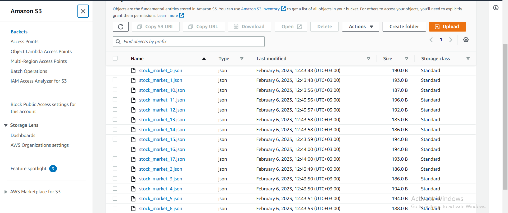
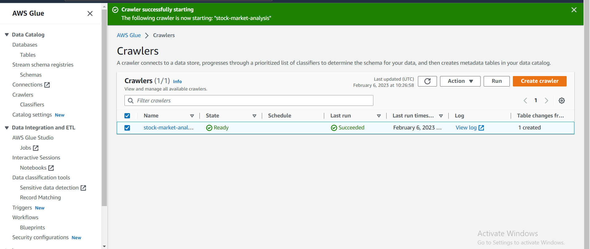
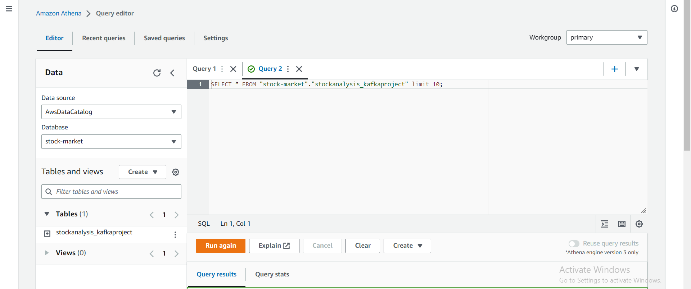
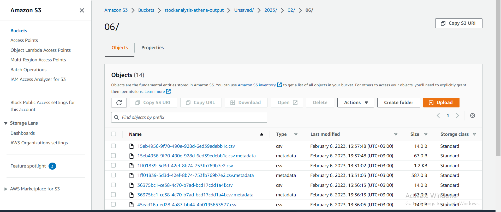

### AWS results

This file is intended to show the AWS side of this project after data is loaded to the S3 as seen below

After the data is loaded to the S3 bucket, we set up and run the **Glue Crawler** to transfor that data into a format we can Query using athena.

The screenshot above shows the crawler after it is run. (Notice the new table that is created in the Catalogue)

The next step is to Query this data on Athena. As demonstrated below

After querying the table, the data is then stored in a different S3 bucket(as displayed below) for more analysis(if need be), like visualization etc.

